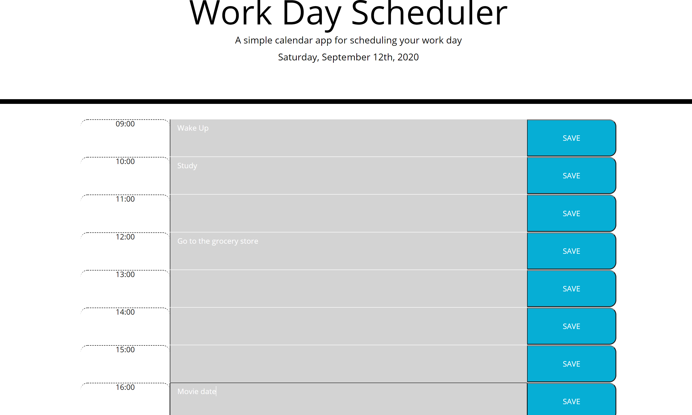

# Work-Day-Scheduler

## Description

Friendly reminder that if you need a daily scheduler, you've got one right here! With this Work Day Scheduler app, you can fill in your day's plans from 9 AM to 5 PM. As a prior service soldier and a supporter of our soldiers serving this country, the time on this app is displayed in military time, a.k.a 24 hour time! Not only can you put in your todo list, but the scheduler also shows you whether the hours has passed, has not yet come, or you are currently on the hour with COLOR CODING. Green means the hour hasn't come, grey represents the past hours, and red is the current hour! How cool, huh? Make sure to save the the row you've typed in, otherwise you'll lose what you wrote!

When making the JavaScript for this application, I learned how to must more easily dynamically generate HTML content IN JavaScript instead of hard coding everything into the HTML file. I also grasped a better understanding of how to use Local Storage, which before this homework, I didn't understand one bit.

## Credits

Thank you to the other students in this Bootcamp course with me, who sit on the Discord study chat and work together!

A more specific thank you to Jonathan Canales and Jude Clark, who took time out of their busy days to give me one on one assistance with some issues I was having and help me understand better what I was doing and how to do it!

## Layout

Official Site: https://jamjon94.github.io/Work-Day-Scheduler/

Here's what to expect!

## License

Copyright (c) [2020] [JamieJones]

Permission is hereby granted, free of charge, to any person obtaining a copy of this software and associated documentation files (the "Software"), to deal in the Software without restriction, including without limitation the rights to use, copy, modify, merge, publish distribute, sublicense, and/or sell copies of the Software, and to permit persons to whom the Software is furnished to do so, subject to the following conditions:

The above copyright notice and this permission notice shall be included in all copies or substantial portions of the Software.

THE SOFTWARE IS PROVIDED "AS IS", WITHOUT WARRANTY OF ANY KIND, EXPRESS OR IMPLIED, INCLUDING BUT NOT LIMITED TO THE WARRANTIES OF MERCHANTABILITY, FITNESS FOR A PARTICULAR PURPOSE AND NONINFRINGEMENT. IN NO EVENT SHALL THE AUTHORS OR COPYRIGHT HOLDERS BE LIABLE FOR ANY CLAIM, DAMAGES OR OTHER LIABILITY, WHETHER IN AN ACTION OF CONTRACT, TORT OR OTHERWISE, ARISING FROM, OUT OF OR IN CONNECTION WITH THE SOFTWARE OR THE USE OR OTHER DEALINGS IN THE SOFTWARE.
